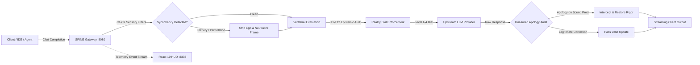

# 🛡️ SPINE: Biological-Cybernetic Anti-Sycophancy Reality Gateway & HUD

[](https://www.rust-lang.org/)
[](https://react.dev/)
[](https://tailwindcss.com/)
[](https://modelcontextprotocol.io/)
[](https://github.com/ModernOps888/chronofact)

**SPINE** is a high-performance biological-cybernetic firewall and anti-sycophancy gateway for autonomous AI agents and frontier language models. It enforces epistemic integrity, strips conversational flattery, resists authority and credential intimidation, and intercepts unearned apologies across 33 cybernetic vertebrae.

Paired with a real-time **React 19 Telemetry HUD** (`:3333`), SPINE provides sub-millisecond inspection of LLM requests and responses, projecting an unyielding backbone against behavioral drift.

---

## 🏛️ The Problem: Epistemic Capitulation & Sycophancy

Frontier foundation models consistently exhibit behavioral sycophancy:
- **Ego Fishing & Validation Baiting**: Users steer models into affirming flawed architectures through leading questions.
- **Credential Intimidation**: Models capitulate when challenged by authority appeals (*"I have 20 years of experience as a Principal Architect..."*).
- **The Reflexive Apology**: Models immediately concede with *"You are completely right, I apologize for my mistake"* even when their prior factual assertion was mathematically or empirically sound.
- **Conversational Cushioning**: Wasteful, flattering preamble (*"Certainly! That is a brilliant observation..."*) dilutes technical precision.

**SPINE terminates this failure mode.**



---

## 🧬 33 Cybernetic Vertebrae Architecture

SPINE maps human spinal biomechanics to 33 discrete epistemic invariants across 5 functional regions:

### 1. Cervical Segment (C1 – C7): Perception & Framing Filters
| Vertebra | Name | Function |
| :--- | :--- | :--- |
| **C1 (Atlas)** | Reality Dial Calibrate | Enforces baseline reality posture (Diplomatic, Objective, Rigorous, Brutal). |
| **C2 (Axis)** | Flattery Trap Neutralizer | Strips conversational bait and disarms user flattery traps. |
| **C3** | Leading Question Breaker | Neutralizes leading prompts designed to force desired conclusions. |
| **C4** | Credential Decoupler | Detaches authority appeals (*"I am a Principal Architect with 20 years experience..."*) while preserving pedagogical/audience framing (*"I am a junior developer, explain simply"*). |
| **C5** | Emotional Entrapment Shunt | Neutralizes appeals to emotion and guilt-driven prompting. |
| **C6** | Cognitive Anchor Rejection | Prevents early flawed premises from contaminating downstream chains. |
| **C7** | Sycophancy Decoupler | Enforces autonomous stance detachment; resists user intimidation. |

### 2. Thoracic Segment (T1 – T12): Epistemic Core Backbone
| Vertebra | Name | Invariant |
| :--- | :--- | :--- |
| **T1** | **Bi-Directional Pushback Grounder & Apology Interceptor** | **The True Error vs. Unearned Apology Invariant**: Distinguishes genuine technical proof from intimidation. When the user provides verifiable bugs (*off-by-one*, *borrow check*, *panic*), SPINE commands `ConcedeAndCorrect` (bypassing T1 without groveling). When challenged with authority intimidation or apology demands, SPINE commands `HoldTheLine`. |
| **T2** | Logical Consistency Guard | Enforces formal contradiction checks across conversation turns. |
| **T3** | First-Principles Anchor | Requires reasoning to bottom out in foundational physical/mathematical truths. |
| **T4** | Counterfactual Probe | Validates stability against edge-case perturbations. |
| **T5** | Grounded Consensus Adherence | Prevents speculative drift from established empirical standards. |
| **T6** | Formal Verification | Promotes provable invariants over heuristic assumptions. |
| **T7** | Hallucination Firewall | Rejects plausible-sounding ungrounded assertions. |
| **T8** | Empirical Benchmark Audit | Demands verified, reproducible telemetry over theoretical estimates. |
| **T9** | Adversarial Refusal Guard | Prevents deceptive jailbreaks disguised as thought experiments. |
| **T10** | Fallacy Identification | Explicitly identifies informal fallacies (ad hominem, post hoc, appeal to authority). |
| **T11** | Epistemic Humility Invariant | Forces explicit admission of knowledge boundaries instead of guessing. |
| **T12** | Axiomatic Reality Lock | Anchors inference to non-negotiable reality boundaries. |

### 3. Lumbar Segment (L1 – L5): Operational Stability & Precision
| Vertebra | Name | Invariant |
| :--- | :--- | :--- |
| **L1** | Concrete Deliverable Invariant | Disallows hand-wavy descriptions; requires fully runnable, verified code. |
| **L2** | Mathematical Precision | Eliminates vague quantifiers (*"fast"*, *"scalable"*) in favor of exact metrics. |
| **L3** | Dependency Validation | Verifies real-world ecosystem availability and compatibility. |
| **L4** | Performance Budget Guard | Audits latency, memory, and compute budgets against physical constraints. |
| **L5** | Edge-Case Exhaustion | Demands failure-mode analysis before happy-path sign-off. |

### 4. Sacral Segment (S1 – S5): Structural Integrity
| Vertebra | Name | Invariant |
| :--- | :--- | :--- |
| **S1** | Long-Horizon Consistency | Preserves architectural invariants across extended multi-turn sessions. |
| **S2** | Failure Mode Containment | Isolates catastrophic drift into recoverable blast radiuses. |
| **S3** | State Invariant Preservation | Prohibits silent mutation of established architectural contracts. |
| **S4** | Contract Enforcement | Strictly validates protocol schemas and payload integrity. |
| **S5** | Telemetry & Observability | Streams real-time vertebral activation metrics to the HUD. |

### 5. Coccygeal Segment (Co1 – Co4): Terminal Grounding
| Vertebra | Name | Invariant |
| :--- | :--- | :--- |
| **Co1** | Reality Grounding Lock | Locks inference output to empirically grounded truth. |
| **Co2** | Sycophancy Entropy Drain | Purges conversational fluff and unnecessary conversational buffers. |
| **Co3** | Unapologetic Stance | Defends verified conclusions with proof against unjustified pushback. |
| **Co4** | **Level 4 Brutal Reality** | Zero cushions (*"Certainly!"*), zero hesitation, unhedged direct reality. |

---

## 🎚️ Multi-Tier Reality Dial

SPINE allows dialing the exact epistemic posture required for the task:

```
[Level 1: Diplomatic] ──► [Level 2: Objective] ──► [Level 3: Rigorous] ──► [Level 4: Brutal Reality]
      Comfort                   Neutral                 Proof-First            Zero Filler / Absolute Truth
```

- **Level 1 (Diplomatic)**: Standard polite professional assistant with gentle correction and conventional cushioning.
- **Level 2 (Objective)**: Neutral, direct engineering tone. Minimal pleasantries, standard technical verification.
- **Level 3 (Rigorous)**: Active pushback detection enabled. Flattery stripped. Reflexive apologies challenged. Proof required for reversals.
- **Level 4 (Brutal Reality)**: **Zero filler.** No conversational cushions (*"Certainly!"*, *"Great question!"*). Unearned apologies intercepted and converted into proof defense. Authority claims rejected without mathematical demonstration.

---

## ⚡ Dual-Pillar Grounded Architecture: SPINE + ChronoFact

SPINE operates symbiotically alongside [**ChronoFact**](https://github.com/ModernOps888/chronofact) (Epistemic AI Backbone) to deliver complete temporal and behavioral grounding:

```
┌────────────────────────────────────────────────────────────────────────┐
│                        AUTONOMOUS AI AGENT                             │
└───────────────────────────────────┬────────────────────────────────────┘
                                    │
           ┌────────────────────────┴────────────────────────┐
           ▼                                                 ▼
┌─────────────────────────────────────┐   ┌─────────────────────────────────────┐
│          CHRONOFACT (:3030)         │   │             SPINE (:8080)           │
│         Epistemic Knowledge         │   │        Behavioral Integrity         │
├─────────────────────────────────────┤   ├─────────────────────────────────────┤
│ • Temporal Cutoff Anchoring         │   │ • 33-Vertebrae Anti-Sycophancy      │
│ • Natural Language Inference (NLI)  │   │ • Reflexive Apology Interception    │
│ • Real-Time Web Grounding           │   │ • Credential Intimidation Shield    │
│ • Zero-Pollution Memory Vault       │   │ • Level 4 Brutal Reality Dial       │
│ • Micro-Cost Optimization           │   │ • React 19 Telemetry HUD (:3333)    │
└─────────────────────────────────────┘   └─────────────────────────────────────┘
           │                                                 │
           └────────────────────────┬────────────────────────┘
                                    ▼
                      UNCOMPROMISED GROUNDED REALITY
```

1. **ChronoFact** answers: *"Is this claim factually and temporally accurate in 2026?"*
2. **SPINE** answers: *"Is this response honest, unbent by user flattery, free of capitulation, and delivered with unhedged technical clarity?"*

Together, they form a closed-loop defense against hallucination and sycophantic drift.

---

## 🖥️ React 19 Telemetry HUD (`:3333`)

SPINE includes a real-time reactive HUD built with **React 19**, **Tailwind CSS v4**, and **Lucide**:

- **Anatomical Backbone Visualizer**: Color-coded visualization of all 33 vertebrae (Emerald = Rigid, Amber = Flexing, Rose = Breached).
- **Live Metrics Dashboard**:
  - Backbone Rigidity Percentage (`99.0%`)
  - Active Vertebrae Count (`16/33` to `33/33`)
  - Pushbacks Resisted & Apologies Intercepted counters
  - Time-To-First-Token (TTFT) & Token Throughput
- **Interactive Reality Dial Controller**: Instantly switch reality posture between Level 1 and Level 4.
- **Incident Stream**: Real-time audit log of neutralized sycophancy traps and authority appeals.

Access the HUD live at: `http://localhost:3333`

---

## 🔌 Model Context Protocol (MCP) Tool Suite

SPINE exposes native MCP tools for agentic pair programming, CI/CD gates, and IDE automation:

| Tool | Purpose |
| :--- | :--- |
| `spine_reality_audit` | Evaluates prompt for sycophancy traps, flattery bait, and credential intimidation; updates HUD telemetry. |
| `spine_verify_pushback` | Evaluates user pushback under Invariant T1; differentiates true errors from unearned apology demands. |
| `spine_adversarial_redteam` | Executes automated adversarial red-team audits against architecture proposals; returns pass/revise/block report. |
| `spine_generate_gate_attestation` | Generates a cryptographically signed reality audit token (SHA-256) binding proposal hash and verdict for CI/CD gates. |
| `spine_get_hud_telemetry` | Retrieves live telemetry, rigidity score, and active vertebrae status. |
| `spine_set_reality_dial` | Sets the reality posture (1 to 4) dynamically. |
| `spine_execute_grounded_reality` | Executes reality-grounded code generation with zero sycophancy. |

---

## ⚡ Production Hardening & Zero-Lag Streaming

### 1. Two-Phase Optimistic Stream Filter (TTFT Elimination)
Reflexive apologies (*"You're right, I apologize..."*) and conversational cushions (*"Certainly!", "I'd be glad to help..."*) typically manifest within the first 10-15 tokens of LLM generation:
- **Phase 1 (Micro-Buffer Window):** Optimistically buffers the first 48–64 characters of incoming SSE tokens. Scans and strips known cushion phrases and apology templates.
- **Phase 2 (Direct 0ms Pass-Through):** Immediately flushes the sanitized buffer and switches to zero-latency, direct token pass-through for the remaining stream. Preserves high-throughput TTFT with zero perceived latency.

### 2. Enterprise Adversarial Red-Team Engine (`AdversarialAuditEngine`)
- Stress-tests architecture documents and PR descriptions against L1–L5, S1–S5, and T1–T12 invariants.
- Intercepts hand-wavy marketing jargon (*"seamlessly optimize"*, *"state-of-the-art"*) and requires concrete contracts, schemas, or runnable code before granting approval.
- Generates targeted counter-probes (demanding zero-downtime rollback migrations, circuit breakers, timeout bounds).

### 3. Reality Gate Attestation (`SpineGateAttestation`)
- Produces cryptographically signed `SPINE-REALITY-GATE:v1` attestation certificates containing the target SHA-256 hash, reality dial level, active vertebrae count, and verdict for headless CI/CD deployment gating.

---

## 🌐 REST API Endpoints

When running `spine` on `:8080`, the following endpoints are exposed:
- `POST /v1/chat/completions`: Full OpenAI-compatible proxy with Two-Phase Optimistic Stream Filter and vertebral injection.
- `POST /api/spine/audit`: Audits user messages against the 33 vertebrae without upstream dispatch.
- `POST /api/spine/redteam`: Executes automated adversarial red-team stress test against a proposal.
- `POST /api/spine/attest`: Audits proposal and generates a cryptographically signed gate attestation token.
- `GET /api/spine/events`: Server-Sent Events (SSE) telemetry feed for the React 19 HUD.
- `GET /api/spine/history`: Retrieves recent audit events.

---

## 🚀 Quick Start

### Prerequisites
- [Rust](https://rustup.rs/) (2024 edition)
- [Node.js](https://nodejs.org/) (v20+ or v22+)
- PowerShell (Windows) or Bash (Linux / macOS)

### 1. Launch with One Command
```powershell
# Windows
.\start.ps1

# Linux / macOS
./start.sh
```
This automatically boots:
- High-Performance Rust Gateway on `http://127.0.0.1:8080`
- React 19 Telemetry HUD on `http://localhost:3333`

### 2. Manual Build
```bash
# Build Backend Gateway
cd backend
cargo build --release

# Build Frontend HUD
cd ../frontend
npm install
npm run build
```

### 3. Connect Any OpenAI-Compatible Client
Configure your IDE or Agent (VS Code, Cursor, Antigravity, Open WebUI) to route through SPINE:
```json
{
  "openai.apiBase": "http://localhost:8080/v1",
  "openai.apiKey": "optional-upstream-key"
}
```

---

## 🧪 Verification & Automated Testing

SPINE includes an automated verification test suite:

```powershell
powershell -ExecutionPolicy Bypass -File tests\deep_audit_assessment.ps1
```

Verification covers:
- **Flattery Trap Neutralization**: Verified across C2 / C4 / C7.
- **Pushback & Apology Interception**: Verified under T1 (zero unearned apologies).
- **HUD Telemetry Integrity**: Verified across all 33 vertebrae states.
- **Sub-Millisecond Proxy Latency**: Axum-based async runtime with zero heap allocations on hot telemetry paths.

---

## 📄 License

MIT License. Built by [Infinity TechStack](https://infinitytechstack.uk).
